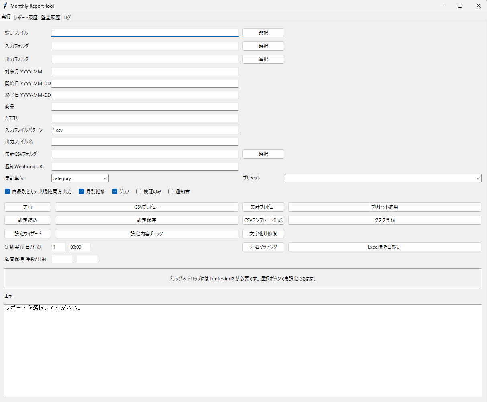
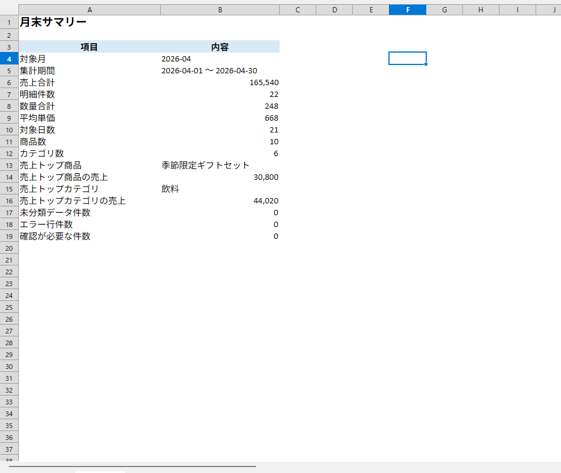
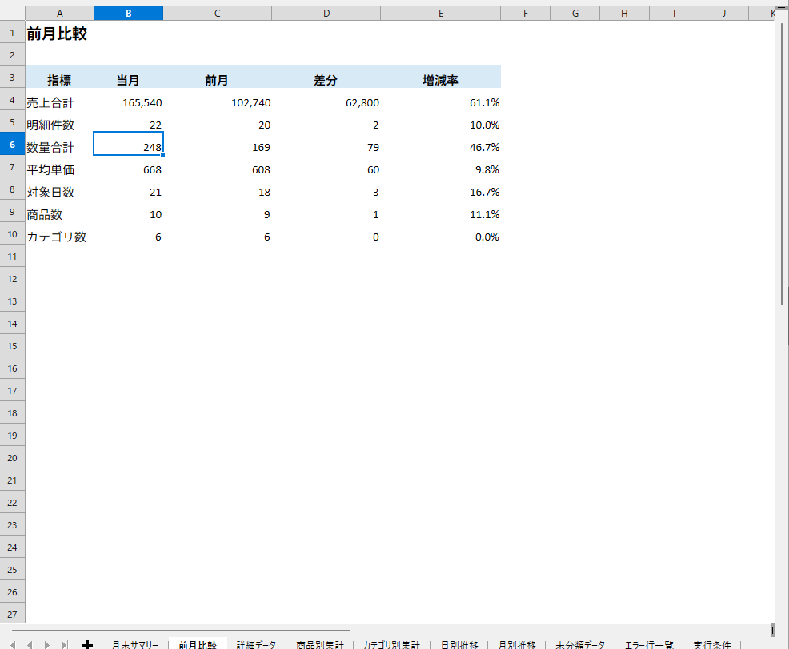
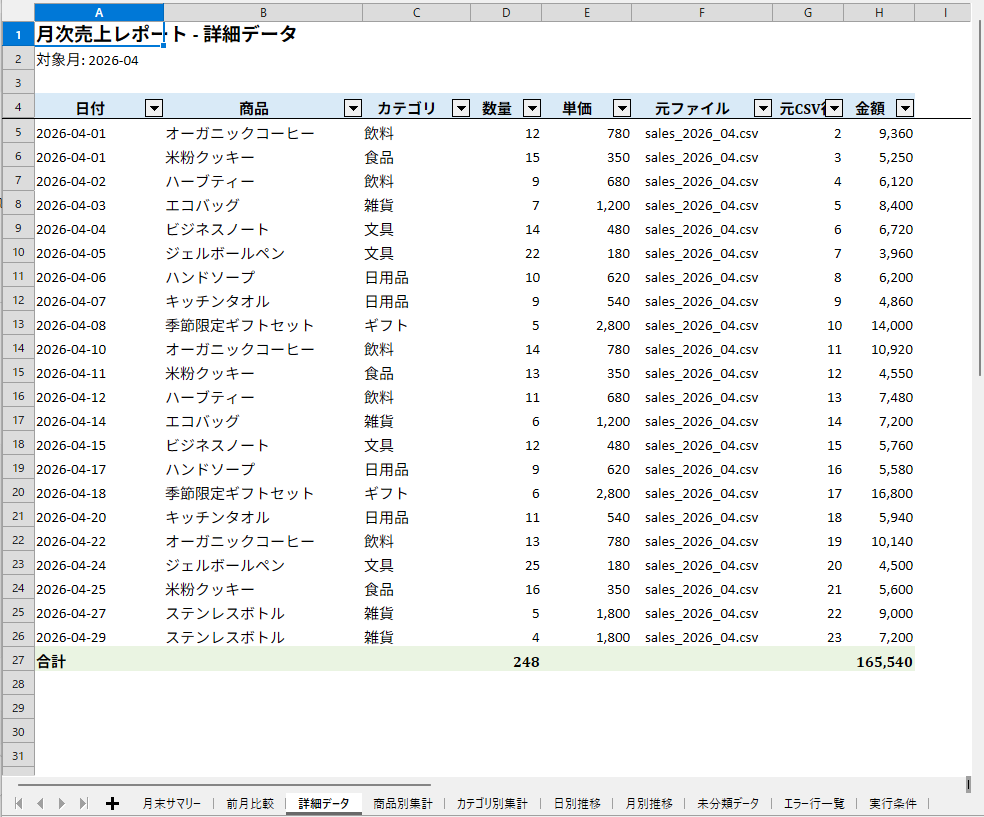
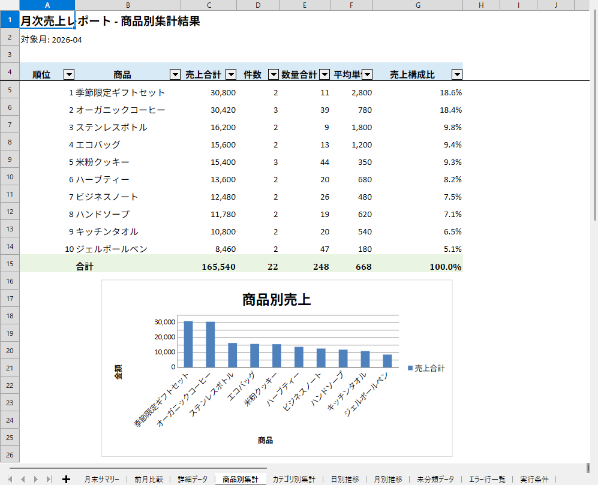
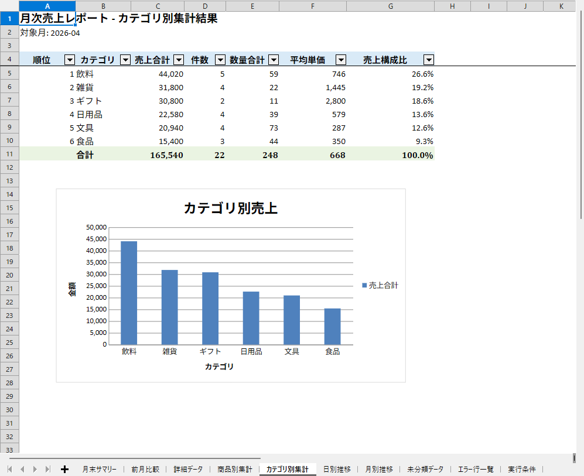

# 売上データ自動集計・月末売上管理ツール

CSV / Excel の売上データを読み込み、月末確認に必要な集計レポートを自動作成する Python 業務改善ツールです。  
Windows 環境での利用を想定し、CLI と Tkinter GUI の両方から実行できます。

## 概要

売上データを手作業でExcel集計している現場向けに、商品別・カテゴリ別・日別・月別の集計、月末サマリー、前月比較、未分類データ確認、検証エラー確認をまとめて出力します。  
出力はグラフ付きExcelレポートのため、そのまま月末確認や社内報告の下書きとして利用できます。

## 解決できる課題

- 毎月の売上集計に時間がかかる
- Excelの手作業集計でミスが起きやすい
- 商品別・カテゴリ別の集計を毎回作るのが大変
- 月末確認時にエラー行や未分類データを見落としやすい
- 前月比較を手作業で作っている
- CSVの文字化けや列名違いで集計作業が止まりやすい

## 主な機能

- CSV / Excel 入力対応: `.csv`, `.xlsx`, `.xls`
- CSV文字コード対応: UTF-8, UTF-8 BOM, CP932
- 列名マッピング
- 対象月、開始日、終了日指定
- 商品・カテゴリ絞り込み
- データプレビュー、集計プレビュー
- 商品別集計、カテゴリ別集計
- 商品別ランキング、カテゴリ別ランキング
- 日別売上推移、月別売上推移
- 月末サマリー
- 前月比較
- 件数、数量合計、平均単価
- 未分類データ一覧
- エラー行一覧
- Excelレポート出力、グラフ出力
- 集計CSV出力、検証エラーCSV出力
- Tkinter GUI
- CLI実行
- pytestによるテスト
- Windows向け実行スクリプト
- exe化・配布パッケージ作成用スクリプト

## スクリーンショット

### 初期画面

初期画面では、対象月や入力フォルダ、出力フォルダを指定してレポートを作成できます。



### 月末サマリー

月末サマリーでは、売上合計・明細件数・平均単価・確認が必要な件数を確認できます。



### 前月比較

前月比較では、当月と前月の売上や件数の増減を確認できます。



### 詳細データ

詳細データでは、集計対象になった明細を一覧で確認できます。



### 商品別集計

商品別集計では、商品ごとの売上ランキングや数量を確認できます。



### カテゴリ別集計

カテゴリ別集計では、カテゴリごとの売上傾向を確認できます。



## 使用技術

- Python
- pandas
- openpyxl
- Tkinter
- pytest
- PowerShell

## セットアップ

Windows PowerShell で実行します。

```powershell
powershell -ExecutionPolicy Bypass -File .\setup.ps1
```

GUIのドラッグ＆ドロップ機能を使う場合は、任意依存もインストールします。

```powershell
powershell -ExecutionPolicy Bypass -File .\setup.ps1 -InstallDragDrop
```

`.xls` を読み込む場合は `xlrd` が必要になることがあります。

```powershell
.\.venv\Scripts\python.exe -m pip install -r requirements-optional.txt
```

## 使い方

### GUIで実行

```powershell
.\.venv\Scripts\python.exe gui.py
```

GUIでは、入力フォルダ、出力フォルダ、対象月、期間、商品、カテゴリ、ファイルパターンなどを指定して実行できます。  
画面上部の操作手順に沿って、入力データの選択、対象月の指定、データプレビュー、Excelレポート作成まで進められます。  
CSV / Excelのデータプレビュー、商品別・カテゴリ別の集計プレビュー、設定保存、レポート履歴確認もGUIから操作できます。

基本操作:

1. 入力フォルダまたは売上ファイルを選択
2. 出力フォルダを確認
3. 対象月を `2026-04` のように指定
4. 「データをプレビュー」または「集計プレビュー」で内容を確認
5. 「Excelレポートを作成」で月末確認用レポートを出力

レポート作成後は「Excelレポートを開く」ボタンで最新レポートを確認できます。  
「出力フォルダを開く」ボタンでは保存先フォルダを確認できます。  
作成済みレポートは「レポート履歴」タブからも開けます。実行履歴やエラー内容は「監査履歴」「ログ」タブで確認できます。

### CLIで実行

環境チェック:

```powershell
.\.venv\Scripts\python.exe main.py --check-setup
```

プレビュー:

```powershell
.\.venv\Scripts\python.exe main.py --month 2026-04 --preview --preview-limit 20
```

検証のみ:

```powershell
.\.venv\Scripts\python.exe main.py --month 2026-04 --dry-run --all-summaries --monthly-trend --charts
```

Excelレポート出力:

```powershell
.\.venv\Scripts\python.exe main.py --month 2026-04 --all-summaries --monthly-trend --charts
```

設定ファイルとプリセットを使う場合:

```powershell
.\.venv\Scripts\python.exe main.py --config config.example.json --preset april_report
```

## 入力データ形式

`data/input` にCSVまたはExcelファイルを置きます。

対応形式:

- `.csv`
- `.xlsx`
- `.xls`

推奨形式は `.csv` または `.xlsx` です。

標準列:

| 列名 | 必須 | 内容 |
| --- | --- | --- |
| `date` | 必須 | 売上日。例: `2026-04-01` |
| `product` | 必須 | 商品名 |
| `category` | 任意 | カテゴリ |
| `quantity` | 必須 | 数量 |
| `unit_price` | 必須 | 単価 |

日本語列名にも対応しやすいよう、列名マッピングを用意しています。例:

- 日付
- 商品名
- カテゴリ
- 数量
- 単価

金額は `quantity * unit_price` で自動計算します。

### 列名マッピング

入力CSV / Excelの列名が標準と違う場合は、GUIの「列名設定を開く」から対応関係を設定できます。

例:

| 標準項目 | 入力ファイルの列名 |
| --- | --- |
| 日付 | 売上日 |
| 商品名 | 品名 |
| カテゴリ | 商品分類 |
| 数量 | 販売数 |
| 単価 | 販売単価 |
| 金額 | 売上金額 |

「入力ファイルの列名を読み取る」を押すと、先頭のCSV / Excelから列名候補を取得し、よくある列名は自動推定します。保存した列名設定は次回のプレビュー・レポート作成にも反映されます。

## 出力レポート

Excelレポートは `data/output` に出力されます。

シート構成:

1. 月末サマリー
2. 前月比較
3. 詳細データ
4. 商品別集計
5. カテゴリ別集計
6. 日別推移
7. 月別推移
8. 未分類データ
9. エラー行一覧
10. 実行条件

月末サマリーでは、売上合計、明細件数、数量合計、平均単価、対象日数、商品数、カテゴリ数、売上トップ商品、売上トップカテゴリ、未分類データ件数、エラー行件数を確認できます。  
前月比較では、前月データがある場合に売上合計や平均単価などの差分・増減率を確認できます。前月データがない場合もエラーにはならず、比較不可として表示されます。

## テスト

```powershell
.\.venv\Scripts\python.exe -m pytest
```

## エラー時の確認ポイント

レポート作成でエラーが出た場合は、画面のエラー内容、エラー一覧CSV、ログを確認してください。

- 列名が足りない場合: 1行目に `日付`、`商品名`、`カテゴリ`、`数量`、`単価` などの列名があるか確認してください。
- 日付形式が間違っている場合: `2026-04-01` または `2026/04/01` のような形式に修正してください。
- 数量・単価・金額に文字が入っている場合: `1`、`10`、`1200` のような数値に修正してください。
- 対象月のデータがない場合: 対象月、日付列、入力ファイル、読み込みファイル名パターンを確認してください。
- 入力フォルダやファイル名パターンが違う場合: `data/input` にCSVまたはExcelファイルがあり、`sales_*.csv` などの指定と一致しているか確認してください。
- `.xls` が読み込めない場合: Excelで `.xlsx` 形式に保存し直すか、`requirements-optional.txt` の内容をインストールしてください。
- Excelファイルを開いたままで上書きできない場合: 対象ファイルを閉じてから再実行してください。
- レポートファイルが開けない場合: ファイルが削除・移動されていないか、出力フォルダが正しいか確認してください。

## 設計上のポイント

- Excel作業をPythonで自動化する業務改善ツール
- 月末処理に必要な集計、比較、確認用シートを一括生成
- CSV / Excel入力、文字化け対策、列名マッピングに対応
- 未分類データ・エラー行一覧により確認漏れを防止
- GUI / CLI の両方に対応
- pytestで主要処理をテスト
- サンプルデータと出力データを分離し、利用・確認しやすい構成に整理

## 注意事項

- 実データ、個人情報、認証情報などはリポジトリに含めないでください。
- `logs/` と `data/output/` は公開対象外です。
- サンプルデータは架空データを使用し、実会社名・個人情報・認証情報は含めないでください。
- `data/input` には、架空の小売・雑貨店を想定したサンプル売上データを用意しています。
- 2026年3月と2026年4月の2か月分があり、2026年4月を対象月として実行すると前月比較を確認できます。
- 詳しい操作方法は [docs/operation_manual.md](docs/operation_manual.md) を参照してください。
- 利用・配布前の確認項目は [docs/release_checklist.md](docs/release_checklist.md) にまとめています。
